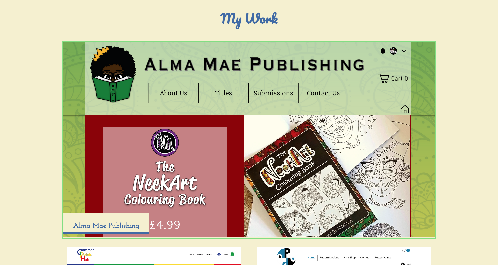
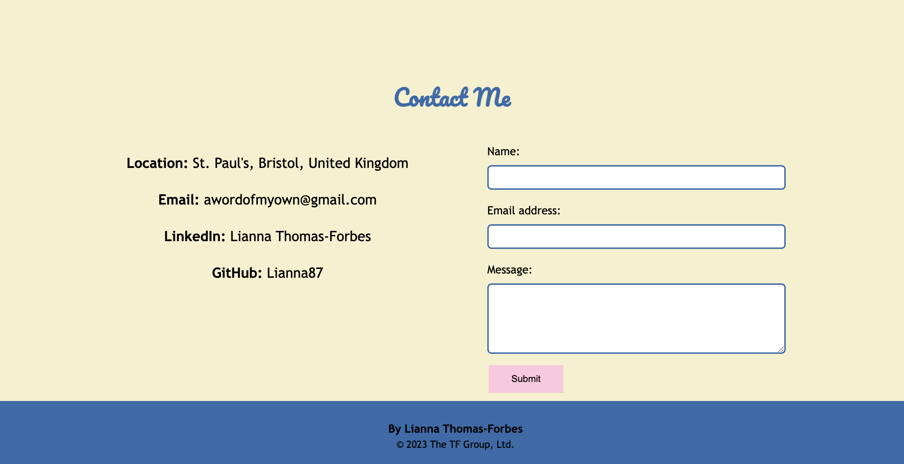

# LiannaTF-Portfolio

## Description

This assignment was to build a portfolio page, which can be added to as the course progresses to showcase my skills and talents to potential employers.

### Tasks completed
* Page created that presents my name, a recent photo and navigation bar when loaded.
* Navigation includes links to sections about me, my work and how to contact me.
* When one of the links is clicked, UI jumps to corresponding section.
* Titled images of my applications included in 'my work' section.

** NOTE:
The applications on the page are examples projects I have done for friends and family over the years, using Wix.com.
I did not create any of the code and have included them here as placeholders.
The first application does not include a link as it is no longer active.

### Links

Deployed website: (https://lianna87.github.io/LiannaTF-Portfolio/)

Code repository:(https://github.com/Lianna87/LiannaTF-Portfolio)

#### Usage

The webpage can be viewed in a traditional desktop web browser once deployed. 

#### Screenshots

